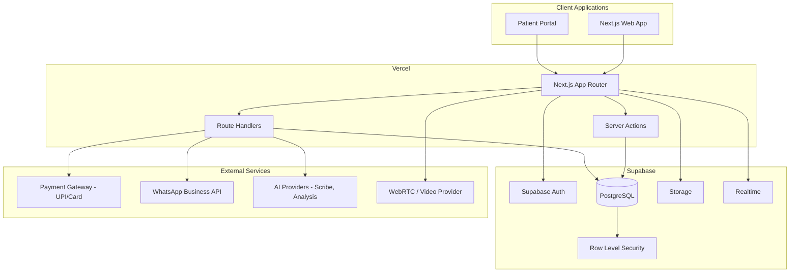
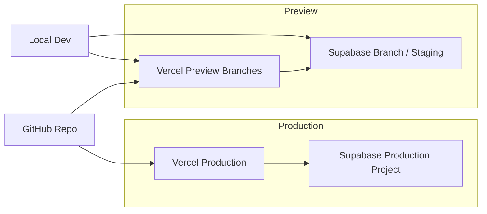
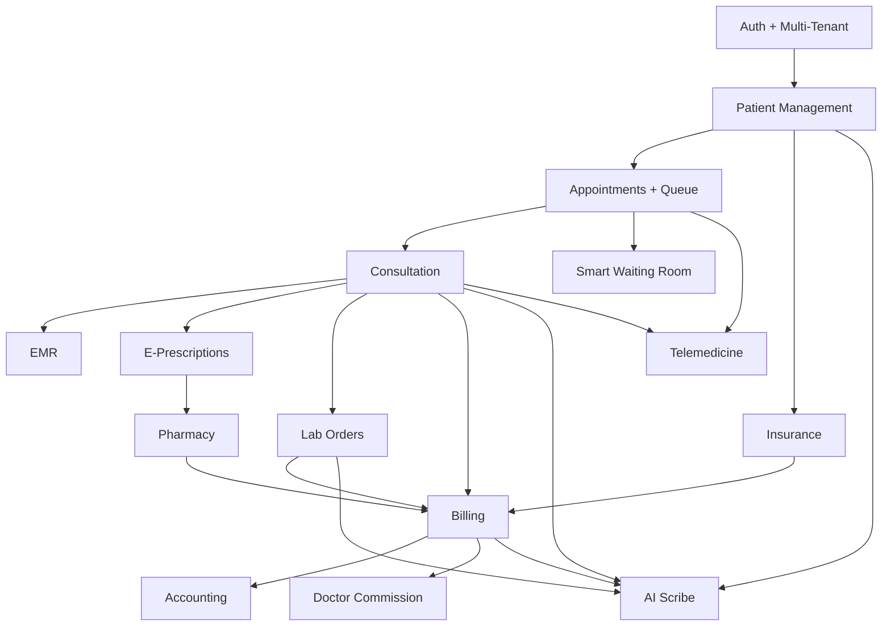

# ClinicOS AI — Architecture

> **Stack:** Next.js 16 · Supabase (PostgreSQL, Auth, Storage, Realtime) · Vercel

This document is the single source of truth for modules, features, use cases, and technical architecture. See also [PRODUCT_VISION.md](./PRODUCT_VISION.md).

---

## Table of Contents

1. [System Overview](#system-overview)
2. [Tech Stack](#tech-stack)
3. [Multi-Tenancy](#multi-tenancy)
4. [User Roles & Use Cases](#user-roles--use-cases)
5. [Module 1: Patient Management](#module-1-patient-management)
6. [Module 2: Appointment Management](#module-2-appointment-management)
7. [Module 3: Consultation Management](#module-3-consultation-management)
8. [Module 4: E-Prescriptions](#module-4-e-prescriptions)
9. [Module 5: Medical Records (EMR)](#module-5-medical-records-emr)
10. [Module 6: Billing](#module-6-billing)
11. [Module 7: Insurance](#module-7-insurance)
12. [Module 8: Lab Management](#module-8-lab-management)
13. [Module 9: Pharmacy Management](#module-9-pharmacy-management)
14. [Module 10: Inventory](#module-10-inventory)
15. [Module 11: Telemedicine](#module-11-telemedicine)
16. [AI Features](#ai-features)
17. [Financial Management](#financial-management)
18. [Smart Waiting Room](#smart-waiting-room)
19. [Real-Time Requirements](#real-time-requirements)
20. [Data Model (High Level)](#data-model-high-level)
21. [Security & Compliance](#security--compliance)
22. [Deployment Architecture](#deployment-architecture)

---

## System Overview



---

## Tech Stack

| Layer | Technology | Notes |
|-------|------------|-------|
| Framework | Next.js 16 (App Router) | Server Components, Server Actions |
| Language | TypeScript | Strict mode |
| Styling | Tailwind CSS 4 | Role-based UI shells |
| Database | Supabase PostgreSQL | Migrations via Supabase CLI |
| Auth | Supabase Auth | Email, phone OTP; role in `profiles` |
| Authorization | Supabase RLS + app middleware | Tenant isolation by `clinic_id` |
| File storage | Supabase Storage | Reports, X-rays, MRI, prescriptions, insurance docs |
| Real-time | Supabase Realtime | Token queue, current token updates |
| Deployment | Vercel | Preview + production environments |
| Payments | Razorpay (or similar) | UPI, card, cash recording |
| WhatsApp | Meta WhatsApp Business API | AI appointment assistant |
| AI | OpenAI / compatible APIs | Scribe, lab analysis, billing, risk, follow-up |
| Video | Daily.co / Twilio / WebRTC | Telemedicine module |
| PDF | Server-side generation | E-prescription PDFs |

---

## Multi-Tenancy

### Tenant Model

- **Platform** — Super Admin scope; manages clinics, plans, subscriptions
- **Clinic** — Primary tenant boundary; all clinical and operational data scoped to `clinic_id`
- **User** — Belongs to platform (Super Admin) or exactly one clinic (all other roles)

### Isolation Strategy

1. Every tenant-scoped table includes `clinic_id UUID NOT NULL`
2. Supabase RLS policies filter by `clinic_id` from JWT / session
3. Next.js middleware resolves tenant from subdomain or path
4. Super Admin uses elevated policies or service role for cross-tenant reads

### Tenant Hierarchy

```
platform
└── clinics
    ├── users (doctors, receptionists, owners)
    ├── patients
    ├── appointments
    ├── tokens / queue
    ├── consultations / emr_records
    ├── prescriptions
    ├── bills / payments
    ├── insurance_policies / claims
    ├── lab_orders / lab_reports
    ├── pharmacy_items / stock
    ├── inventory_items
    ├── teleconsult_sessions
    └── clinic_settings
```

---

## User Roles & Use Cases

### Super Admin

| Use Case | Description |
|----------|-------------|
| UC-SA-01 | Create and manage clinic tenants |
| UC-SA-02 | Suspend or reactivate clinics |
| UC-SA-03 | Define subscription plans (features, limits, pricing) |
| UC-SA-04 | Assign or change clinic subscription |
| UC-SA-05 | View platform-wide revenue analytics |
| UC-SA-06 | View AI usage analytics (tokens, calls, cost per clinic) |
| UC-SA-07 | Configure white-label branding (logo, colors, domain) |
| UC-SA-08 | Manage platform-level settings |

### Clinic Owner

| Use Case | Description |
|----------|-------------|
| UC-CO-01 | Complete clinic onboarding and configuration |
| UC-CO-02 | Add, edit, deactivate doctors |
| UC-CO-03 | Add, edit, deactivate receptionists |
| UC-CO-04 | View clinic revenue dashboard |
| UC-CO-05 | Manage pharmacy inventory |
| UC-CO-06 | Manage general inventory (PPE, supplies) |
| UC-CO-07 | Configure consultation fees, hours, departments |
| UC-CO-08 | Configure doctor commission rules |
| UC-CO-09 | View accounting reports (P&L, cash flow) |
| UC-CO-10 | Export tax reports |

### Doctor

| Use Case | Description |
|----------|-------------|
| UC-DR-01 | View list of today's appointments |
| UC-DR-02 | Open patient profile before/during consultation |
| UC-DR-03 | View past visits, medicines, lab reports, allergies |
| UC-DR-04 | Write consultation notes |
| UC-DR-05 | Create e-prescription |
| UC-DR-06 | Receive allergy warning when prescribing contraindicated medicine |
| UC-DR-07 | Order lab tests |
| UC-DR-08 | Generate referral to another doctor/specialist |
| UC-DR-09 | View patient vitals trends (weight, BP, sugar, etc.) |
| UC-DR-10 | Approve, reject, or request reschedule of appointment |
| UC-DR-11 | Conduct teleconsultation |
| UC-DR-12 | Prescribe during teleconsultation |
| UC-DR-13 | Use AI Medical Scribe during consultation |

### Receptionist

| Use Case | Description |
|----------|-------------|
| UC-RC-01 | Register new patient (walk-in) |
| UC-RC-02 | Search and update existing patient |
| UC-RC-03 | Book appointment for patient (scheduled) |
| UC-RC-04 | Book walk-in appointment |
| UC-RC-05 | Book emergency appointment (priority queue) |
| UC-RC-06 | Generate queue token for patient |
| UC-RC-07 | Update current token number (broadcast to all waiting patients) |
| UC-RC-08 | Mark patient as called / serving / completed |
| UC-RC-09 | Handle no-show and late arrival |
| UC-RC-10 | Handle VIP patient priority |
| UC-RC-11 | Take payment (cash, UPI, card) |
| UC-RC-12 | Support QR check-in (verify token issued) |

### Patient

| Use Case | Description |
|----------|-------------|
| UC-PT-01 | Create account / login |
| UC-PT-02 | Book appointment (choose doctor and slot) |
| UC-PT-03 | View upcoming and past appointments |
| UC-PT-04 | Receive queue token after booking or check-in |
| UC-PT-05 | View live queue status (current token, position, expected time) |
| UC-PT-06 | Scan clinic QR to check in and receive token |
| UC-PT-07 | Pay consultation/lab fees online (UPI, card) |
| UC-PT-08 | View medical history and visit timeline |
| UC-PT-09 | View and download prescriptions (PDF) |
| UC-PT-10 | View lab reports |
| UC-PT-11 | Receive notification when lab report is ready |
| UC-PT-12 | Join teleconsultation |
| UC-PT-13 | Share reports during teleconsultation |
| UC-PT-14 | Book appointment via WhatsApp AI assistant |

---

## Module 1: Patient Management

**Purpose:** Core patient record — the foundation for all clinical modules.

### Data Stored

#### Personal Details

| Field | Notes |
|-------|-------|
| Name | Full legal name |
| Age | Computed from DOB or stored |
| Gender | |
| Date of birth | |
| Blood group | |
| Address | |
| Emergency contact | Name, phone, relationship |
| Aadhaar | Optional (India) |
| Insurance details | Link to Module 7 |

#### Medical Information

| Field | Notes |
|-------|-------|
| Height | |
| Weight | Current + historical trend |
| BMI | Calculated |
| Temperature | |
| Blood pressure | Systolic / diastolic |
| Pulse | |
| Oxygen saturation (SpO2) | |
| Sugar levels | Fasting / random / HbA1c |
| Allergies | Critical for prescription module |
| Medical history | Previous illnesses |
| Surgeries | Past surgical history |
| Family history | |
| Smoking | Status / pack-years |
| Alcohol | Status / frequency |
| Chronic diseases | Diabetes, hypertension, etc. |

#### Documents

| Type | Examples |
|------|----------|
| Reports | Lab, pathology |
| Imaging | X-rays, MRI scans |
| Prescriptions | Historical paper/digital |
| Insurance documents | Policy cards, claim forms |

### Features

| Feature | Description |
|---------|-------------|
| F-PM-01 | Patient registration (receptionist / self-service) |
| F-PM-02 | Patient profile view and edit |
| F-PM-03 | Vitals capture at visit or registration |
| F-PM-04 | Document upload and categorization |
| F-PM-05 | Allergy list with severity |
| F-PM-06 | Medical history timeline |
| F-PM-07 | Weight trend chart (e.g. 80kg → 78kg → 75kg → 73kg) |
| F-PM-08 | Vitals trend charts (BP, sugar, etc.) |
| F-PM-09 | Doctor view of progress over time |
| F-PM-10 | Optional Aadhaar storage (encrypted, consent-based) |
| F-PM-11 | Patient search (name, phone, ID) |
| F-PM-12 | Duplicate patient detection |

### Use Cases

| ID | Use Case |
|----|----------|
| UC-PM-01 | Receptionist registers new patient with personal and contact details |
| UC-PM-02 | Staff records vitals at check-in |
| UC-PM-03 | Doctor reviews weight trend for diabetes/obesity/fitness patient |
| UC-PM-04 | Staff uploads X-ray/MRI to patient documents |
| UC-PM-05 | Doctor reviews allergy list before consultation |
| UC-PM-06 | Patient views own profile and document history |
| UC-PM-07 | System calculates BMI from height/weight |
| UC-PM-08 | Staff links insurance policy to patient record |

### Edge Cases

- Historical vitals stored as time-series (not overwritten)
- Weight trend useful for diabetes, obesity, fitness, nutrition tracking
- Optional Aadhaar — not required for all clinics

---

## Module 2: Appointment Management

**Purpose:** Scheduling, doctor workflow, and smart queue with digital tokens.

### Features

| Feature | Description |
|---------|-------------|
| F-AM-01 | Patient self-booking (doctor + slot selection) |
| F-AM-02 | Receptionist booking (walk-in, scheduled, emergency) |
| F-AM-03 | Doctor approve / reject / reschedule |
| F-AM-04 | Doctor availability and slot management |
| F-AM-05 | Token generation on booking or check-in |
| F-AM-06 | Smart queue management |
| F-AM-07 | Live queue display for patients |
| F-AM-08 | Expected wait time calculation |
| F-AM-09 | Current token display (updated by receptionist) |
| F-AM-10 | Priority queue (emergency, VIP, walk-in) |
| F-AM-11 | No-show handling |
| F-AM-12 | Late arrival handling |
| F-AM-13 | Appointment reminders (SMS/email/WhatsApp) |
| F-AM-14 | Calendar view for doctors and reception |

### Token System Example

```
Your Token:     #45
Current Token:  #38
Expected Time:  4:20 PM
```

Patient sees live updates as receptionist advances the queue.

### Use Cases

| ID | Use Case |
|----|----------|
| UC-AM-01 | Patient books appointment online for tomorrow |
| UC-AM-02 | Patient selects preferred doctor and time slot |
| UC-AM-03 | Doctor approves pending appointment request |
| UC-AM-04 | Doctor rejects appointment with reason |
| UC-AM-05 | Doctor or receptionist reschedules appointment |
| UC-AM-06 | Receptionist creates walk-in appointment and token |
| UC-AM-07 | Receptionist creates emergency appointment (queue priority) |
| UC-AM-08 | Receptionist marks appointment as no-show |
| UC-AM-09 | Receptionist handles late arrival (reposition in queue) |
| UC-AM-10 | VIP patient receives priority token |
| UC-AM-11 | Patient views live queue on phone while in waiting room |
| UC-AM-12 | System calculates expected time from avg consultation duration |

### Edge Cases

| Case | Handling |
|------|----------|
| No-show | Mark status, optionally notify, free slot |
| Late arrival | Re-queue or merge based on clinic policy |
| Emergency patient | Insert at front of queue |
| VIP patient | Priority flag on token |
| Walk-in patient | No pre-booking; token issued immediately |

---

## Module 3: Consultation Management

**Purpose:** Doctor workflow during an active patient visit.

### Features

| Feature | Description |
|---------|-------------|
| F-CM-01 | Open patient profile from appointment |
| F-CM-02 | View past visits |
| F-CM-03 | View past medicines |
| F-CM-04 | View lab reports |
| F-CM-05 | View allergies prominently |
| F-CM-06 | Write consultation notes |
| F-CM-07 | Record symptoms and diagnosis |
| F-CM-08 | Auto-save notes during consultation |
| F-CM-09 | Permanent storage of all consultation data |
| F-CM-10 | Start/end consultation session |
| F-CM-11 | Link consultation to appointment and token |

### Use Cases

| ID | Use Case |
|----|----------|
| UC-CM-01 | Doctor opens patient profile at start of visit |
| UC-CM-02 | Doctor reviews past visits and medicines |
| UC-CM-03 | Doctor reviews lab reports inline |
| UC-CM-04 | Doctor writes notes during consultation |
| UC-CM-05 | Notes saved permanently to EMR |
| UC-CM-06 | Doctor records symptoms and working diagnosis |
| UC-CM-07 | Doctor ends consultation and triggers billing/prescription |

---

## Module 4: E-Prescriptions

**Purpose:** Digital prescriptions with safety checks and instant patient delivery.

### Prescription Structure

| Field | Example |
|-------|---------|
| Medicine | Paracetamol |
| Dosage | 500mg |
| Frequency | Morning, Night |
| Duration | 5 Days |
| Instructions | After food, etc. |

### Features

| Feature | Description |
|---------|-------------|
| F-EP-01 | Create prescription during or after consultation |
| F-EP-02 | Multiple medicines per prescription |
| F-EP-03 | Dosage, frequency, duration, instructions per line item |
| F-EP-04 | Generate PDF instantly |
| F-EP-05 | Deliver PDF to patient (app, email, download) |
| F-EP-06 | Allergy conflict detection |
| F-EP-07 | Warn doctor if patient allergic to prescribed medicine |
| F-EP-08 | Prescription history on patient profile |
| F-EP-09 | Doctor signature / clinic letterhead on PDF |
| F-EP-10 | AI-generated prescription draft (from scribe) |

### Use Cases

| ID | Use Case |
|----|----------|
| UC-EP-01 | Doctor creates prescription after consultation |
| UC-EP-02 | System warns "Patient allergic to penicillin" when relevant |
| UC-EP-03 | Patient receives PDF prescription instantly |
| UC-EP-04 | Patient views prescription history |
| UC-EP-05 | Pharmacy dispenses based on e-prescription reference |

### Smart Features

- Cross-check prescribed medicine against patient allergy list
- Block or warn on known contraindications

---

## Module 5: Medical Records (EMR)

**Purpose:** Complete longitudinal record — every visit becomes a permanent entry.

### Record Structure (Per Visit)

| Component | Content |
|-----------|---------|
| Visit metadata | Visit #1, #2, #3… date, doctor, clinic |
| Symptoms | Patient-reported and observed |
| Diagnosis | ICD / plain text |
| Medicines | Prescribed during visit |
| Reports | Lab/imaging ordered or reviewed |
| Notes | Consultation notes |
| Vitals | Snapshot at visit |
| Referrals | If any |

### Features

| Feature | Description |
|---------|-------------|
| F-EMR-01 | Auto-create EMR entry on consultation complete |
| F-EMR-02 | Complete visit timeline on patient profile |
| F-EMR-03 | Search records by date, doctor, diagnosis |
| F-EMR-04 | Immutable audit trail (append-only corrections) |
| F-EMR-05 | Export patient record (PDF bundle) |
| F-EMR-06 | Doctor-only vs patient-visible field controls |

### Use Cases

| ID | Use Case |
|----|----------|
| UC-EMR-01 | System creates Visit #3 record after consultation |
| UC-EMR-02 | Doctor scrolls full timeline before new visit |
| UC-EMR-03 | Patient views own visit history |
| UC-EMR-04 | Clinic exports records for referral or legal request |

---

## Module 6: Billing

**Purpose:** Automated invoicing, multi-method payments, and AI-assisted revenue integrity.

### Bill Components

| Charge Type | Source |
|-------------|--------|
| Consultation fees | Clinic fee schedule / doctor |
| Lab fees | Lab orders (Module 8) |
| Medicine fees | Pharmacy dispensing (Module 9) |
| Other | Procedures, consumables |

### Payment Methods

| Method | Notes |
|--------|-------|
| UPI | Online via payment gateway |
| Card | Debit/credit |
| Cash | Recorded by receptionist |
| Insurance | Bill to insurance / copay |

### Features

| Feature | Description |
|---------|-------------|
| F-BL-01 | Auto-generate bill on consultation complete |
| F-BL-02 | Line items for consultation, lab, medicine |
| F-BL-03 | Apply discounts and insurance copay |
| F-BL-04 | Online payment (UPI, card) |
| F-BL-05 | Cash payment recording |
| F-BL-06 | Invoice PDF generation |
| F-BL-07 | Payment status tracking (paid, partial, unpaid) |
| F-BL-08 | AI Billing Assistant — missing charges |
| F-BL-09 | AI Billing Assistant — duplicate billing detection |
| F-BL-10 | AI Billing Assistant — unpaid invoice alerts |
| F-BL-11 | AI Billing Assistant — insurance eligibility check |
| F-BL-12 | Revenue dashboard for clinic owner |
| F-BL-13 | Receipt generation |

### Use Cases

| ID | Use Case |
|----|----------|
| UC-BL-01 | System generates bill after consultation with consultation fee |
| UC-BL-02 | Lab charges added automatically when tests ordered |
| UC-BL-03 | Patient pays via UPI online |
| UC-BL-04 | Receptionist records cash payment |
| UC-BL-05 | AI flags duplicate charge on same visit |
| UC-BL-06 | AI flags consultation completed but no bill created |
| UC-BL-07 | Owner views daily/weekly revenue |
| UC-BL-08 | Patient views and pays unpaid invoices |

---

## Module 7: Insurance

**Purpose:** Policy management and claims lifecycle.

### Policy Data

| Field | Notes |
|-------|-------|
| Insurance company | |
| Policy number | |
| Expiry date | |
| Coverage details | Optional |
| Member ID | |

### Features

| Feature | Description |
|---------|-------------|
| F-IN-01 | Store insurance details on patient profile |
| F-IN-02 | Multiple policies per patient |
| F-IN-03 | Expiry alerts |
| F-IN-04 | Claim creation |
| F-IN-05 | Claim tracking (submitted → processing → approved/rejected) |
| F-IN-06 | Claim approval status updates |
| F-IN-07 | Attach supporting documents to claim |
| F-IN-08 | Link claim to bill/visit |
| F-IN-09 | Insurance document upload |

### Use Cases

| ID | Use Case |
|----|----------|
| UC-IN-01 | Staff enters patient insurance policy |
| UC-IN-02 | System alerts when policy near expiry |
| UC-IN-03 | Receptionist creates insurance claim for visit |
| UC-IN-04 | Staff tracks claim until approved |
| UC-IN-05 | Bill routed through insurance with copay calculation |

---

## Module 8: Lab Management

**Purpose:** Test ordering, report delivery, and AI-powered patient-friendly analysis.

### Example Tests

- CBC (Complete Blood Count)
- Blood sugar
- Thyroid panel
- Lipid profile
- Custom test catalog per clinic

### Features

| Feature | Description |
|---------|-------------|
| F-LM-01 | Doctor orders tests during consultation |
| F-LM-02 | Lab test catalog management |
| F-LM-03 | Lab staff uploads report (PDF/image) |
| F-LM-04 | Link report to patient and visit |
| F-LM-05 | Notify patient when report ready |
| F-LM-06 | Patient views report in portal |
| F-LM-07 | AI Lab Analysis — plain-language explanation |
| F-LM-08 | AI flags abnormal values |
| F-LM-09 | Historical lab results comparison |
| F-LM-10 | Lab charges flow to billing |

### Use Cases

| ID | Use Case |
|----|----------|
| UC-LM-01 | Doctor orders CBC and sugar test |
| UC-LM-02 | Lab uploads report PDF |
| UC-LM-03 | Patient receives notification |
| UC-LM-04 | AI explains "Your cholesterol is higher than normal" in simple language |
| UC-LM-05 | Doctor reviews report in patient profile during follow-up |

---

## Module 9: Pharmacy Management

**Purpose:** In-clinic pharmacy — stock, dispensing, expiry management.

### Features

| Feature | Description |
|---------|-------------|
| F-PH-01 | Medicine catalog |
| F-PH-02 | Stock quantity tracking |
| F-PH-03 | Batch and expiry date tracking |
| F-PH-04 | Expiry alerts (e.g. "Paracetamol expires in 15 days") |
| F-PH-05 | Dispense against e-prescription |
| F-PH-06 | Auto-decrement stock on dispense |
| F-PH-07 | Purchase/restock entries |
| F-PH-08 | Pharmacy charges flow to billing |
| F-PH-09 | Low stock alerts |
| F-PH-10 | Search medicine by name |

### Use Cases

| ID | Use Case |
|----|----------|
| UC-PH-01 | Owner adds medicines to pharmacy catalog |
| UC-PH-02 | System alerts medicine expiring in 15 days |
| UC-PH-03 | Staff dispenses medicine per prescription |
| UC-PH-04 | Stock decremented automatically |
| UC-PH-05 | Medicine cost added to patient bill |

---

## Module 10: Inventory

**Purpose:** Non-pharmacy clinic supplies — PPE, syringes, test kits, etc.

### Tracked Items (Examples)

| Item | Notes |
|------|-------|
| Syringes | |
| Gloves | |
| PPE | Masks, gowns |
| Test kits | Rapid tests, etc. |
| General consumables | Cotton, bandages |

### Features

| Feature | Description |
|---------|-------------|
| F-IV-01 | Inventory item catalog |
| F-IV-02 | Stock in / stock out tracking |
| F-IV-03 | Low stock alerts |
| F-IV-04 | Reorder level configuration |
| F-IV-05 | Expiry tracking (where applicable) |
| F-IV-06 | Usage linked to department or procedure (optional) |
| F-IV-07 | Inventory reports for clinic owner |

### Use Cases

| ID | Use Case |
|----|----------|
| UC-IV-01 | Owner sets reorder level for gloves |
| UC-IV-02 | System alerts when gloves below threshold |
| UC-IV-03 | Receptionist records stock usage |
| UC-IV-04 | Owner views monthly consumption report |

---

## Module 11: Telemedicine

**Purpose:** Remote video consultations with full clinical workflow.

### Features

| Feature | Description |
|---------|-------------|
| F-TM-01 | Schedule teleconsultation appointment |
| F-TM-02 | Patient joins video call from portal |
| F-TM-03 | Doctor joins from dashboard |
| F-TM-04 | Patient shares reports during call |
| F-TM-05 | Doctor writes notes during call |
| F-TM-06 | Doctor prescribes medicine post-call |
| F-TM-07 | Consultation recorded in EMR |
| F-TM-08 | Teleconsultation billing |
| F-TM-09 | Call waiting room |
| F-TM-10 | Session recording (optional, with consent) |

### Use Cases

| ID | Use Case |
|----|----------|
| UC-TM-01 | Patient books teleconsultation slot |
| UC-TM-02 | Patient joins call at scheduled time |
| UC-TM-03 | Patient uploads/shares lab report during call |
| UC-TM-04 | Doctor prescribes medicine after teleconsultation |
| UC-TM-05 | Visit appears in EMR timeline |

---

## AI Features

### 1. AI Medical Scribe

| Aspect | Detail |
|--------|--------|
| Input | Doctor's speech during consultation |
| Output | Symptoms, diagnosis, notes, prescription draft |
| Example | "Patient reports headache for 3 days" → structured clinical note |
| Value | Saves doctors hours daily — primary selling point |

**Use Cases:** UC-AI-01 Doctor activates scribe; UC-AI-02 Doctor reviews and approves AI draft; UC-AI-03 Draft feeds into EMR and prescription

### 2. AI Appointment Assistant (WhatsApp)

| Aspect | Detail |
|--------|--------|
| Channel | WhatsApp chatbot |
| Capability | Natural language appointment booking |
| Example | Patient: "Need appointment tomorrow" → AI books slot |

**Use Cases:** UC-AI-04 Patient messages clinic WhatsApp; UC-AI-05 AI finds slot and confirms booking; UC-AI-06 AI sends reminder before appointment

### 3. AI Billing Assistant

| Aspect | Detail |
|--------|--------|
| Checks | Missing charges, duplicate billing, unpaid invoices |
| Also | Insurance eligibility verification |
| Value | Revenue leakage prevention |

**Use Cases:** UC-AI-07 Daily scan for unbilled consultations; UC-AI-08 Flag duplicate lab charge; UC-AI-09 Verify insurance before visit

### 4. AI Follow-Up Agent

| Aspect | Detail |
|--------|--------|
| Channel | Automated call or message |
| Example | "Are you taking medicines regularly?" |
| Output | Updates adherence status in system |

**Use Cases:** UC-AI-10 Post-prescription follow-up call; UC-AI-11 Record patient response; UC-AI-12 Alert doctor if non-adherence

### 5. AI Health Risk Detection

| Aspect | Detail |
|--------|--------|
| Input | BP, weight, sugar trends |
| Output | Risk flags (e.g. "High Diabetes Risk") |
| Display | Doctor dashboard and optionally patient |

**Use Cases:** UC-AI-13 Analyze vitals trends after each visit; UC-AI-14 Flag at-risk patients for proactive follow-up

### 6. AI Lab Analysis

| Aspect | Detail |
|--------|--------|
| Input | Lab report values |
| Output | Plain-language explanation for patient |
| Example | "Your cholesterol is higher than normal" |

**Use Cases:** UC-AI-15 Generate patient-friendly summary on report upload; UC-AI-16 Highlight abnormal values for doctor

---

## Financial Management

### Accounting Module

Replaces Excel-based clinic accounting.

| Feature | Description |
|---------|-------------|
| F-AC-01 | Record income (from billing module) |
| F-AC-02 | Record expenses (manual entry) |
| F-AC-03 | Expense categories (salaries, rent, utilities, supplies) |
| F-AC-04 | Salary tracking |
| F-AC-05 | Rent and utilities tracking |
| F-AC-06 | Profit & Loss report |
| F-AC-07 | Cash flow report |
| F-AC-08 | Tax report generation |
| F-AC-09 | Date range filtering |
| F-AC-10 | Export to CSV/PDF |

**Use Cases:** UC-AC-01 Owner records monthly rent; UC-AC-02 Owner generates P&L for quarter; UC-AC-03 Owner exports data for CA/tax filing

### Doctor Commission Management

| Feature | Description |
|---------|-------------|
| F-DC-01 | Configurable split per doctor (e.g. 60/40) |
| F-DC-02 | Auto-calculate from consultation revenue |
| F-DC-03 | Monthly payout report per doctor |
| F-DC-04 | Clinic share vs doctor share breakdown |
| F-DC-05 | Adjustment entries (bonuses, deductions) |

**Use Cases:** UC-DC-01 Owner sets Doctor A at 60% commission; UC-DC-02 System calculates monthly payout; UC-DC-03 Owner exports payout report

---

## Smart Waiting Room

### QR Check-In

| Step | Action |
|------|--------|
| 1 | Clinic displays QR code (print or screen) |
| 2 | Patient scans with phone |
| 3 | Patient authenticated / identified |
| 4 | System checks in patient |
| 5 | Token generated automatically |
| 6 | Patient sees queue position — no receptionist needed |

**Features:** F-SW-01 Clinic QR generation; F-SW-02 Mobile check-in flow; F-SW-03 Auto token on scan; F-SW-04 Link to today's appointment if exists

### Live Token Display

| Feature | Description |
|---------|-------------|
| F-SW-05 | Receptionist updates current token number |
| F-SW-06 | All waiting patients see update in real time |
| F-SW-07 | Show patient their token vs current token |
| F-SW-08 | Estimated wait time based on queue position |
| F-SW-09 | Public waiting room display (optional TV mode) |

**Use Cases:** UC-SW-01 Patient scans QR on arrival; UC-SW-02 Receptionist advances token #38 → #39; UC-SW-03 All patients' screens update instantly; UC-SW-04 Patient #45 sees "~7 ahead, est. 4:20 PM"

---

## Real-Time Requirements

| Event | Publisher | Subscribers | Technology |
|-------|-----------|-------------|------------|
| Current token changed | Receptionist dashboard | Patient apps, waiting room display | Supabase Realtime |
| Token called | Receptionist | Specific patient | Supabase Realtime |
| Queue position updated | System | Waiting patients | Supabase Realtime |
| Lab report ready | Lab staff | Patient app | Supabase Realtime + push notification |

---

## Data Model (High Level)

### Core Tables

```
clinics
profiles (extends auth.users — role, clinic_id)
patients
patient_vitals (time-series)
patient_documents
patient_allergies
doctors
appointments
queue_tokens
consultations
emr_records
prescriptions
prescription_items
bills
bill_line_items
payments
insurance_policies
insurance_claims
lab_tests
lab_orders
lab_reports
pharmacy_medicines
pharmacy_stock
pharmacy_dispense
inventory_items
inventory_transactions
teleconsult_sessions
subscriptions
plans
expenses
doctor_commissions
ai_usage_logs
```

All tenant tables include `clinic_id` except platform tables (`plans`, `subscriptions`).

---

## Security & Compliance

| Area | Approach |
|------|----------|
| Authentication | Supabase Auth (email, phone OTP) |
| Authorization | RBAC + RLS per role and clinic |
| Tenant isolation | `clinic_id` on all rows + RLS policies |
| PHI / medical data | Encrypted at rest (Supabase); TLS in transit |
| Aadhaar | Optional; encrypt; minimal access; audit log |
| Audit trail | Who accessed/changed patient records |
| File access | Signed URLs via Supabase Storage policies |
| Super Admin | Separate policies; no default cross-tenant access |

---

## Deployment Architecture



| Environment | Vercel | Supabase |
|-------------|--------|----------|
| Local | `next dev` | Local or linked dev project |
| Preview | Auto per PR | Staging branch (optional) |
| Production | Main branch | Production project |

### Environment Variables (Vercel)

```
NEXT_PUBLIC_SUPABASE_URL
NEXT_PUBLIC_SUPABASE_ANON_KEY
SUPABASE_SERVICE_ROLE_KEY
RAZORPAY_KEY_ID
RAZORPAY_KEY_SECRET
WHATSAPP_API_TOKEN
OPENAI_API_KEY
```

---

## Module Dependency Map



---

## Build Phases (Suggested)

| Phase | Scope |
|-------|-------|
| **Phase 0** | Supabase setup, auth, RLS, roles, clinic onboarding |
| **Phase 1** | Patient Management, Appointments, Queue/Tokens, Consultation, EMR, E-Prescriptions, Basic Billing |
| **Phase 2** | Lab, Pharmacy, Inventory, Insurance, QR Check-In |
| **Phase 3** | Telemedicine, AI features, WhatsApp bot, Accounting, Commissions |
| **Phase 4** | Super Admin portal, white-label, platform analytics |

---

## Feature Checklist (Complete)

Use this to verify nothing is missed during implementation.

### Platform & Tenancy
- [ ] Multi-tenant clinic isolation
- [ ] Super Admin clinic management
- [ ] Subscription plans
- [ ] White-label branding
- [ ] Platform revenue analytics
- [ ] AI usage analytics

### Roles
- [ ] Super Admin
- [ ] Clinic Owner
- [ ] Doctor
- [ ] Receptionist
- [ ] Patient

### Module 1 — Patient Management
- [ ] Personal details (name, age, gender, DOB, blood group, address, emergency contact)
- [ ] Aadhaar (optional)
- [ ] Insurance details link
- [ ] Vitals (height, weight, BMI, temp, BP, pulse, SpO2, sugar)
- [ ] Allergies
- [ ] Medical history, surgeries, family history
- [ ] Smoking, alcohol, chronic diseases
- [ ] Documents (reports, X-rays, MRI, prescriptions, insurance docs)
- [ ] Weight trend / vitals history

### Module 2 — Appointments
- [ ] Patient booking (doctor + slot)
- [ ] Doctor approve/reject/reschedule
- [ ] Walk-in, emergency, VIP booking
- [ ] Token generation
- [ ] Smart queue
- [ ] Live queue for patients
- [ ] Expected wait time
- [ ] No-show, late arrival handling

### Module 3 — Consultation
- [ ] Patient profile during visit
- [ ] Past visits, medicines, labs, allergies
- [ ] Consultation notes (permanent)

### Module 4 — E-Prescriptions
- [ ] Medicine, dosage, duration, instructions
- [ ] PDF generation
- [ ] Allergy warnings

### Module 5 — EMR
- [ ] Visit timeline (#1, #2, #3…)
- [ ] Symptoms, diagnosis, medicines, reports per visit

### Module 6 — Billing
- [ ] Consultation, lab, medicine fees
- [ ] UPI, card, cash, insurance
- [ ] AI billing assistant (missing, duplicate, unpaid, eligibility)

### Module 7 — Insurance
- [ ] Policy storage (company, number, expiry)
- [ ] Claim creation, tracking, approval status

### Module 8 — Lab
- [ ] Doctor orders tests
- [ ] Lab uploads report
- [ ] Patient notification
- [ ] AI lab analysis (plain language)

### Module 9 — Pharmacy
- [ ] Medicine stock and expiry
- [ ] Expiry alerts
- [ ] Dispense against prescription

### Module 10 — Inventory
- [ ] Syringes, gloves, PPE, test kits
- [ ] Low stock alerts

### Module 11 — Telemedicine
- [ ] Video consultation
- [ ] Share reports
- [ ] Prescribe after call

### AI
- [ ] Medical Scribe
- [ ] WhatsApp Appointment Assistant
- [ ] Billing Assistant
- [ ] Follow-Up Agent
- [ ] Health Risk Detection
- [ ] Lab Analysis

### Financial
- [ ] Accounting (income, expenses, salaries, rent, utilities)
- [ ] P&L, cash flow, tax reports
- [ ] Doctor commission (auto split, monthly payout)

### Smart Waiting Room
- [ ] QR check-in
- [ ] Auto token on scan
- [ ] Receptionist updates current token
- [ ] Real-time token updates for patients

### Patient Portal
- [ ] Book appointment
- [ ] Pay online
- [ ] Receive/view token
- [ ] View reports, prescriptions, history
- [ ] Teleconsultations

---

*Last updated: project inception — Supabase + Vercel stack.*
