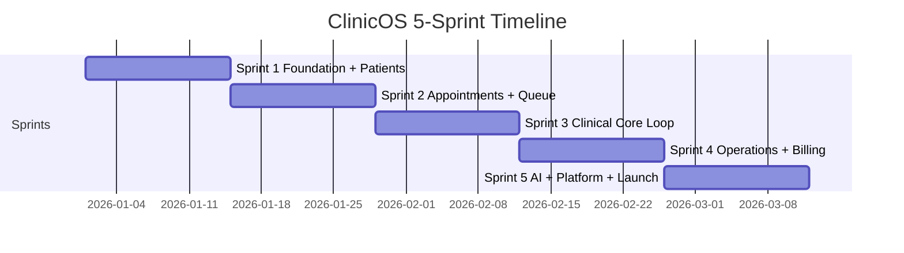

# ClinicOS AI — 5-Sprint Development Plan

> **Goal:** Ship the complete ClinicOS AI platform end-to-end in **5 sprints**.  
> **Stack:** Next.js 16 · Supabase · Vercel  
> **References:** [PRODUCT_VISION.md](./PRODUCT_VISION.md) · [ARCHITECTURE.md](./ARCHITECTURE.md)

---

## Assumptions

| Item | Value |
|------|-------|
| Sprint length | 2 weeks each (10 weeks total) |
| Team | 1–2 full-stack developers (+ optional designer) |
| Sprint cadence | Plan → Build → Test → Deploy → Demo |
| Production target | Vercel (prod) + Supabase (prod) from Sprint 1 |
| Definition of "done" | Feature works in prod, RLS tested, role permissions verified, no critical bugs |

---

## Sprint Overview

| Sprint | Theme | Modules | End-to-End Outcome |
|--------|-------|---------|-------------------|
| **Sprint 1** | Foundation + Patients | Auth, Multi-tenant, Super Admin (basic), Patient Mgmt | Super Admin creates clinic → Owner onboarded → Receptionist registers patients |
| **Sprint 2** | Appointments + Live Queue | Appointments, Smart Waiting Room, Patient Portal (booking) | Patient books → gets token → sees live queue → QR check-in works |
| **Sprint 3** | Clinical Core Loop | Consultation, EMR, E-Prescriptions, Billing (basic) | Full visit: consult → notes → prescription PDF → bill → payment |
| **Sprint 4** | Operations + Extended Billing | Lab, Insurance, Pharmacy, Inventory, AI Lab Analysis | Order lab → upload report → dispense meds → insurance claim → full bill |
| **Sprint 5** | AI + Telemedicine + Platform | All AI, Telemedicine, Accounting, Commissions, Super Admin (full) | Complete SaaS: AI scribe, WhatsApp bot, teleconsult, P&L, white-label |



---

## Cross-Sprint Production Standards

Apply these in **every sprint** — not deferred to Sprint 5.

### Infrastructure (Sprint 1, then maintain)

- [ ] GitHub repo with `main` → Vercel production, PR → preview deploys
- [ ] Supabase project (prod + optional staging branch)
- [ ] Environment variables in Vercel (never commit secrets)
- [ ] Supabase CLI migrations in `supabase/migrations/`
- [ ] Typed Supabase client (`lib/supabase/server.ts`, `lib/supabase/client.ts`)

### Code Quality

- [ ] TypeScript strict mode, no `any` in domain logic
- [ ] Zod validation on all Server Actions and API inputs
- [ ] Consistent error handling (user-friendly messages, logged server-side)
- [ ] Shared UI component library (`components/ui/`)

### Security (every sprint)

- [ ] RLS policy per table before any UI ships
- [ ] Test RLS with each role (patient cannot read other clinic data)
- [ ] Service role key server-only (never `NEXT_PUBLIC_`)
- [ ] File uploads via Supabase Storage with bucket policies

### Observability (from Sprint 3)

- [ ] Vercel Analytics
- [ ] Error tracking (Sentry or Vercel monitoring)
- [ ] Structured logging on payment and AI routes

---

# Sprint 1 — Foundation + Patient Management

**Duration:** Weeks 1–2  
**Sprint goal:** Production-ready platform shell with multi-tenant auth and full patient records.

## What Gets Built

### 1.1 Project Setup & DevOps

| Task | Details |
|------|---------|
| Supabase project | Create prod project; enable Auth, Storage, Realtime |
| Vercel project | Link repo; configure env vars |
| Folder structure | `app/(auth)`, `app/(dashboard)/[role]`, `lib/`, `components/`, `supabase/` |
| Dependencies | `@supabase/ssr`, `@supabase/supabase-js`, `zod`, `date-fns`, shadcn/ui (or similar) |
| Middleware | Auth guard + role redirect + tenant resolution |

### 1.2 Database Schema (Migration 001)

```
clinics
profiles          -- id, role, clinic_id, full_name, phone, avatar_url
plans             -- name, price, features (jsonb), limits
subscriptions     -- clinic_id, plan_id, status, current_period_end
patients
patient_vitals    -- time-series: weight, bp, pulse, spo2, sugar, temp, bmi
patient_allergies
patient_medical_history  -- illnesses, surgeries, family, smoking, alcohol, chronic
patient_documents -- storage path, type, uploaded_by
audit_logs        -- who changed what (patient records)
```

### 1.3 Auth & Roles

| Role | Auth method | Landing route |
|------|-------------|---------------|
| Super Admin | Email + password | `/admin` |
| Clinic Owner | Invite link | `/owner` |
| Doctor | Invite link | `/doctor` |
| Receptionist | Invite link | `/receptionist` |
| Patient | Phone OTP or email | `/patient` |

**Implementation:**
- Supabase Auth with `profiles` table synced via trigger on signup
- Invite flow: Owner sends invite → user sets password → role + `clinic_id` pre-set
- Middleware: `/(dashboard)/*` requires auth; redirect by `profiles.role`

### 1.4 Row Level Security (RLS)

| Table | Policy summary |
|-------|----------------|
| `clinics` | Super Admin: all; Owner/Staff: own `clinic_id` |
| `patients` | Staff: CRUD own clinic; Patient: read/update own record |
| `patient_vitals` | Same as patients |
| `patient_documents` | Staff: CRUD; Patient: read own |

### 1.5 Super Admin (Basic)

| Feature | Production detail |
|---------|-------------------|
| Create clinic | Name, slug, address, phone, owner email |
| Assign plan | Free / Pro / Enterprise (feature flags in JSON) |
| Suspend clinic | Block all staff login for that tenant |
| Clinic list | Search, filter by status/plan |

*Deferred to Sprint 5:* Revenue analytics, AI usage analytics, white-label UI.

### 1.6 Clinic Owner Onboarding

| Feature | Production detail |
|---------|-------------------|
| Clinic settings | Name, hours, consultation fee default, logo upload |
| Invite doctor | Email → creates profile with `role=doctor` |
| Invite receptionist | Email → creates profile with `role=receptionist` |
| Staff list | View, deactivate staff |

### 1.7 Module 1 — Patient Management (Full)

#### Receptionist UI

| Screen | Functionality |
|--------|---------------|
| Patient list | Search by name, phone; pagination |
| Register patient | All personal fields + emergency contact |
| Patient profile | Tabbed: Overview, Vitals, History, Allergies, Documents |
| Record vitals | Height, weight, BMI auto-calc, temp, BP, pulse, SpO2, sugar |
| Vitals history | Chart: weight trend (line), BP trend |
| Allergies | Add/remove with severity (mild/moderate/severe) |
| Medical history | Illnesses, surgeries, family, smoking, alcohol, chronic diseases |
| Documents | Upload to Supabase Storage; categorize (report, x-ray, MRI, prescription, insurance) |
| Optional Aadhaar | Encrypted column; masked display (XXXX-XXXX-1234) |

#### Doctor UI (read-only this sprint)

| Screen | Functionality |
|--------|---------------|
| Patient search | Find patient by name/phone |
| Patient profile | Same tabs as receptionist (read + vitals chart) |

#### Patient Portal (basic)

| Screen | Functionality |
|--------|---------------|
| Profile | View own details |
| Vitals history | View weight/BP trends |
| Documents | View uploaded documents |

### 1.8 UI Shell (All Roles)

- Sidebar navigation per role
- Clinic name + logo in header
- Mobile-responsive layout
- Toast notifications for success/error
- Loading and empty states

## Sprint 1 — End-to-End Demo Flow

```
Super Admin creates "City Clinic" + assigns Pro plan
    → Owner receives invite, sets password, configures clinic
    → Owner invites Receptionist + Doctor
    → Receptionist registers patient "Raj Kumar"
    → Receptionist records vitals (weight 80kg), adds penicillin allergy
    → Receptionist uploads X-ray document
    → Doctor logs in, searches Raj, views profile + weight chart + allergy
    → Patient logs in, sees own profile and documents
```

## Sprint 1 — Definition of Done

- [ ] Deployed on Vercel production URL
- [ ] All 5 roles can log in and land on correct dashboard
- [ ] RLS verified: Clinic A staff cannot see Clinic B patients
- [ ] Patient CRUD + vitals time-series + documents upload works
- [ ] Weight trend chart renders with 2+ data points
- [ ] Migrations versioned in repo
- [ ] No secrets in git

## Sprint 1 — Deliverables

| Deliverable | Location |
|-------------|----------|
| DB migrations | `supabase/migrations/` |
| RLS policies | Same migrations |
| Role dashboards (shell) | `app/(dashboard)/` |
| Patient module | `app/(dashboard)/receptionist/patients/` etc. |
| Shared components | `components/ui/`, `components/patients/` |

---

# Sprint 2 — Appointments + Smart Queue + Patient Booking

**Duration:** Weeks 3–4  
**Sprint goal:** Complete appointment lifecycle with real-time token queue and QR check-in.

## What Gets Built

### 2.1 Database Schema (Migration 002)

```
doctors            -- profile_id, specialization, consultation_fee, slot_duration
doctor_schedules   -- day_of_week, start_time, end_time, is_available
appointments       -- patient_id, doctor_id, date, time, status, type, priority
queue_sessions     -- clinic_id, date, current_token, avg_consultation_mins
queue_tokens       -- session_id, token_number, patient_id, appointment_id, status, priority
```

**Appointment statuses:** `pending`, `confirmed`, `rejected`, `cancelled`, `completed`, `no_show`  
**Appointment types:** `scheduled`, `walk_in`, `emergency`, `vip`  
**Token statuses:** `waiting`, `called`, `serving`, `completed`, `skipped`  
**Priority:** `normal`, `vip`, `emergency` (affects queue order)

### 2.2 Module 2 — Appointment Management

#### Doctor Schedule Setup (Owner/Doctor)

| Feature | Detail |
|---------|--------|
| Weekly schedule | Mon–Sun slots with start/end times |
| Slot duration | Default 15 min (configurable per doctor) |
| Block dates | Mark holidays/unavailable days |
| Consultation fee | Per-doctor override |

#### Patient Booking (Patient Portal)

| Feature | Detail |
|---------|--------|
| Choose doctor | List doctors with specialization |
| Choose date | Calendar with available dates only |
| Choose slot | Available slots excluding booked |
| Book appointment | Creates `pending` appointment |
| My appointments | Upcoming + past list |

#### Doctor Appointment Actions

| Action | Result |
|--------|--------|
| Approve | Status → `confirmed`; optional token pre-generated |
| Reject | Status → `rejected`; reason stored; patient notified |
| Reschedule | New date/time; patient notified |

#### Receptionist Booking

| Type | Behavior |
|------|----------|
| Scheduled | Same as patient booking but staff selects patient |
| Walk-in | Immediate token; no pre-booked slot required |
| Emergency | Priority queue — inserted near front |
| VIP | Priority flag on token |
| No-show | Mark appointment; optionally rebook |
| Late arrival | Reposition token or mark `late` flag |

### 2.3 Smart Waiting Room + Real-Time Queue

#### Queue Session (per clinic per day)

- One active `queue_sessions` row per clinic per day
- `current_token` updated by receptionist
- `avg_consultation_mins` used for ETA calculation

#### Token Generation

| Trigger | Behavior |
|---------|----------|
| Walk-in registration | Auto-assign next token number |
| Appointment check-in | Token linked to appointment |
| QR check-in | Token on scan (see below) |

#### Receptionist Queue Dashboard

| Feature | Detail |
|---------|--------|
| Live queue list | All waiting tokens sorted by priority then number |
| Current token control | Input/button to set current token (#38 → #39) |
| Call next | Mark token `called`, notify patient |
| Start serving | Mark `serving` |
| Complete | Mark `completed`; triggers consultation handoff (Sprint 3) |
| Skip / no-show | Mark token skipped |

#### Real-Time (Supabase Realtime)

Subscribe to `queue_sessions` and `queue_tokens` changes:

```
Receptionist updates current_token
    → All patient screens re-render instantly
    → Waiting room TV display updates (public route)
```

**Patient queue display:**
```
Your Token:     #45
Current Token:  #38
Position:       7 ahead
Expected Time:  4:20 PM
```

**ETA formula:** `(your_token - current_token) × avg_consultation_mins`

### 2.4 QR Check-In (Smart Waiting Room)

| Step | Implementation |
|------|----------------|
| Clinic QR | `/check-in/[clinicSlug]` URL encoded in QR |
| Patient scans | Opens mobile web (patient must be logged in or quick OTP) |
| Identify patient | Match logged-in patient or phone lookup |
| Link appointment | If appointment today → auto link |
| Generate token | Next token number assigned |
| Show queue screen | Immediate live queue view |

**Owner settings:** Download printable QR poster (PDF with clinic logo + QR)

### 2.5 Waiting Room TV Mode

- Public route: `/queue/[clinicSlug]/display`
- Shows current token, recently called tokens
- No PHI — token numbers only
- Real-time via Supabase Realtime

### 2.6 Notifications (Basic)

| Event | Channel |
|-------|---------|
| Appointment confirmed/rejected | In-app + email (Supabase or Resend) |
| Token called | In-app + browser push (optional) |
| Appointment reminder | Email 24h before (cron via Vercel) |

## Sprint 2 — End-to-End Demo Flow

```
Owner sets Doctor schedule (Mon–Fri, 9am–5pm, 15min slots)
    → Patient books appointment for tomorrow 10:00 AM (pending)
    → Doctor approves → confirmed
    → Next day: Patient scans QR at clinic → token #12 issued
    → Walk-in patient registered → token #13 (normal priority)
    → Emergency patient → token #14 (priority — served before #13)
    → Receptionist sets current token #12 → calls #12 → completes
    → Receptionist advances to #14 (emergency)
    → Patient #13 and others see live updates on phone
    → Waiting room TV shows current token
```

## Sprint 2 — Definition of Done

- [ ] Patient can book, doctor can approve/reject/reschedule
- [ ] Walk-in, emergency, VIP queue priority works
- [ ] Real-time token updates < 2s latency (Supabase Realtime)
- [ ] QR check-in generates token without receptionist
- [ ] No-show and late arrival handled
- [ ] RLS: tokens scoped to clinic
- [ ] Deployed to production

## Sprint 2 — Deliverables

| Deliverable | Location |
|-------------|----------|
| Appointment module | `app/(dashboard)/.../appointments/` |
| Queue dashboard | `app/(dashboard)/receptionist/queue/` |
| Patient booking | `app/(dashboard)/patient/appointments/` |
| QR check-in | `app/check-in/[clinicSlug]/` |
| TV display | `app/queue/[clinicSlug]/display/` |
| Realtime hooks | `lib/hooks/use-queue-realtime.ts` |

---

# Sprint 3 — Clinical Core Loop (Consult → Prescribe → Bill)

**Duration:** Weeks 5–6  
**Sprint goal:** Doctors complete full consultations; patients receive prescriptions and pay bills.

## What Gets Built

### 3.1 Database Schema (Migration 003)

```
consultations       -- appointment_id, doctor_id, patient_id, started_at, ended_at, status
consultation_notes  -- symptoms, diagnosis, notes (rich text)
emr_records         -- visit_number, consultation_id, summary (immutable snapshot)
prescriptions
prescription_items  -- medicine, dosage, frequency, duration, instructions
referrals           -- referred_to, reason, notes
bills
bill_line_items     -- description, amount, type (consultation/lab/medicine/other)
payments            -- bill_id, method, amount, status, gateway_ref
clinic_settings     -- tax_rate, invoice_prefix, payment_methods enabled
```

### 3.2 Module 3 — Consultation Management

#### Doctor Consultation Flow

| Step | UI / Action |
|------|-------------|
| 1. Start | From queue "Start serving" or appointment list → opens consultation |
| 2. Patient context | Sidebar: allergies (red banner if penicillin etc.), past visits, past meds, lab reports (placeholder until Sprint 4) |
| 3. Notes | Symptoms, diagnosis (free text + optional ICD later), clinical notes |
| 4. Auto-save | Debounced save every 5s |
| 5. End consultation | Status → completed; triggers EMR + billing |

### 3.3 Module 5 — EMR (Medical Records)

| Feature | Detail |
|---------|--------|
| Auto-create record | On consultation complete → `emr_records` with visit_number incremented |
| Visit timeline | Patient profile tab: Visit #1, #2, #3… newest first |
| Record contents | Symptoms, diagnosis, medicines (from prescription), notes, vitals snapshot |
| Immutable | Corrections via addendum, not overwrite |
| Doctor view | Full timeline before starting new consultation |
| Patient view | Read-only visit history in portal |

### 3.4 Module 4 — E-Prescriptions

| Feature | Detail |
|---------|--------|
| Create prescription | During or after consultation |
| Line items | Medicine, dosage, frequency (Morning/Night/etc.), duration, instructions |
| Allergy check | On add medicine → cross-check `patient_allergies` → modal warning |
| Block/warn | Severe allergy → strong warning; doctor must acknowledge |
| PDF generation | Server-side (e.g. `@react-pdf/renderer` or Puppeteer) with clinic letterhead |
| Storage | PDF in Supabase Storage |
| Patient delivery | Available in patient portal immediately; download button |
| Prescription history | List on patient profile |

**Example prescription PDF:**
```
Paracetamol 500mg — Morning, Night — 5 Days — After food
[Doctor name, registration, clinic stamp]
```

### 3.5 Module 6 — Billing (Core)

#### Auto-Bill Generation

| Trigger | Line items |
|---------|------------|
| Consultation complete | Consultation fee (from doctor/clinic setting) |
| Manual add | Receptionist can add ad-hoc line items |

#### Payment Methods

| Method | Implementation |
|--------|----------------|
| Cash | Receptionist marks paid; receipt generated |
| UPI / Card | Razorpay checkout; webhook confirms payment |
| Insurance | Record as `insurance_pending` (full insurance flow Sprint 4) |

#### Receptionist Billing UI

| Feature | Detail |
|---------|--------|
| Bill list | Filter: paid, unpaid, partial |
| Create/view invoice | PDF invoice download |
| Take payment | Cash recording or Razorpay link |
| Receipt | Auto-generated on payment |

#### Patient Payment UI

| Feature | Detail |
|---------|--------|
| Unpaid bills | List in patient portal |
| Pay online | Razorpay checkout (UPI + card) |
| Payment history | Past payments with receipts |

#### Owner Revenue Dashboard (Basic)

| Widget | Data |
|--------|------|
| Today’s revenue | Sum of payments today |
| This week / month | Chart |
| Unpaid invoices | Count + total amount |

### 3.6 Referrals

- Doctor generates referral note (referral letter PDF)
- Stored in patient documents + EMR record

### 3.7 Integration: Queue → Consultation → Bill

```
Token "Start serving"
    → Consultation opens
    → Doctor writes notes + prescription
    → Doctor ends consultation
    → EMR record created (Visit #N)
    → Bill auto-generated
    → Receptionist collects payment (cash or patient pays online)
    → Token marked completed
```

## Sprint 3 — End-to-End Demo Flow

```
Patient (token #15) called and serving
    → Doctor sees penicillin allergy banner
    → Doctor writes notes: "Headache 3 days, tension type"
    → Doctor adds Paracetamol prescription (no allergy conflict)
    → Doctor tries Amoxicillin → SYSTEM WARNS penicillin allergy → doctor cancels
    → Doctor ends consultation
    → EMR Visit #2 created in timeline
    → Bill ₹500 consultation generated
    → Patient pays via UPI on phone
    → Prescription PDF available in patient portal
    → Owner sees ₹500 in today's revenue
```

## Sprint 3 — Definition of Done

- [ ] Full consultation workflow with auto-save
- [ ] EMR timeline with visit numbers
- [ ] Prescription with allergy warning + PDF
- [ ] Auto-bill on consultation complete
- [ ] Razorpay UPI/card payment works in production (test + live keys)
- [ ] Cash payment + receipt
- [ ] Patient can download prescription and pay bill online
- [ ] Error tracking enabled (Sentry)

## Sprint 3 — Deliverables

| Deliverable | Location |
|-------------|----------|
| Consultation UI | `app/(dashboard)/doctor/consultations/` |
| EMR timeline | `components/patients/emr-timeline.tsx` |
| Prescriptions | `app/(dashboard)/doctor/prescriptions/` |
| PDF templates | `lib/pdf/prescription.tsx`, `lib/pdf/invoice.tsx` |
| Billing | `app/(dashboard)/receptionist/billing/` |
| Razorpay webhook | `app/api/webhooks/razorpay/route.ts` |
| Owner revenue | `app/(dashboard)/owner/revenue/` |

---

# Sprint 4 — Operations (Lab, Pharmacy, Inventory, Insurance)

**Duration:** Weeks 7–8  
**Sprint goal:** Extended clinical operations with full billing integration and AI lab analysis.

## What Gets Built

### 4.1 Database Schema (Migration 004)

```
lab_tests              -- catalog: name, code, price
lab_orders             -- consultation_id, patient_id, status
lab_order_items        -- test_id
lab_reports            -- order_id, file_path, uploaded_at, ai_summary
insurance_policies     -- patient_id, company, policy_number, expiry, member_id
insurance_claims       -- policy_id, bill_id, status, documents
pharmacy_medicines     -- name, generic_name, unit
pharmacy_stock         -- medicine_id, batch, quantity, expiry_date
pharmacy_dispense      -- prescription_item_id, quantity, dispensed_by
inventory_items        -- name, category, unit
inventory_transactions -- item_id, type (in/out), quantity, reason
inventory_alerts       -- item_id, alert_type (low_stock/expiry)
```

### 4.2 Module 8 — Lab Management

| Feature | Detail |
|---------|--------|
| Test catalog | Owner manages tests (CBC, Sugar, Thyroid, Lipid, custom) |
| Doctor orders | During consultation → select tests → creates lab order |
| Lab staff upload | Receptionist/lab role uploads PDF/image to Supabase Storage |
| Link to patient | Report tied to order, consultation, patient |
| Patient notification | In-app + email when report ready |
| Patient portal | View and download reports |
| Doctor view | Reports in patient profile + consultation context |
| Billing integration | Lab fees auto-added to bill |
| Historical comparison | Show past results for same test (basic table) |

#### AI Lab Analysis (First AI Feature)

| Feature | Detail |
|---------|--------|
| Trigger | On report upload (PDF text extraction or manual value entry) |
| AI summary | Plain language: "Your cholesterol is higher than normal" |
| Doctor view | AI summary + flag abnormal values |
| Patient view | Simplified explanation tab on report |
| Implementation | OpenAI API; store result in `lab_reports.ai_summary` |
| Usage logging | Log to `ai_usage_logs` for Sprint 5 analytics |

### 4.3 Module 7 — Insurance

| Feature | Detail |
|---------|--------|
| Policy on patient | Multiple policies per patient |
| Fields | Company, policy number, expiry, member ID, coverage |
| Expiry alerts | Dashboard widget for expiring policies (30 days) |
| Claim creation | Link bill + visit → claim |
| Claim status | `draft` → `submitted` → `processing` → `approved` / `rejected` |
| Documents | Upload claim supporting docs |
| Billing | Insurance copay calculation; balance billed to patient |
| Receptionist UI | Create and track claims |

### 4.4 Module 9 — Pharmacy Management

| Feature | Detail |
|---------|--------|
| Medicine catalog | Owner adds medicines |
| Stock management | Batch, quantity, expiry date |
| Restock | Purchase entry increases stock |
| Dispense | Against prescription item → decrement stock |
| Expiry alerts | Dashboard: "Paracetamol expires in 15 days" |
| Low stock alerts | When quantity < reorder level |
| Billing | Medicine charges auto-added to patient bill |
| Search | By medicine name |

### 4.5 Module 10 — Inventory

| Feature | Detail |
|---------|--------|
| Item catalog | Syringes, gloves, PPE, test kits, consumables |
| Stock in/out | Manual transactions |
| Reorder level | Owner configures per item |
| Low stock alerts | Dashboard + optional email |
| Reports | Monthly consumption (Owner) |

### 4.6 Billing Extensions

| Feature | Detail |
|---------|--------|
| Multi-source bills | Consultation + lab + pharmacy on one invoice |
| Insurance split | Copay vs insurance-covered amounts |
| Duplicate detection | Rule-based: same visit + same charge type flagged |
| Unpaid reminders | Email for bills unpaid > 7 days |

*AI Billing Assistant (deeper) → Sprint 5*

### 4.7 Doctor UI Updates

- Order labs from consultation screen
- View lab reports inline during consultation
- EMR records include lab results

### 4.8 Owner Dashboard Updates

| Widget | Source |
|--------|--------|
| Pharmacy expiry alerts | Module 9 |
| Inventory low stock | Module 10 |
| Insurance expiring | Module 7 |
| Lab orders pending | Module 8 |

## Sprint 4 — End-to-End Demo Flow

```
Doctor during consultation orders CBC + Blood Sugar
    → Lab order created; ₹800 added to bill
    → Lab uploads report PDF
    → AI generates: "Blood sugar slightly elevated at 126 mg/dL"
    → Patient notified; views report + AI summary in portal
    → Doctor prescribes Metformin
    → Pharmacy dispenses Metformin (stock -30 tablets)
    → Medicine ₹200 added to bill
    → Patient has insurance policy on file
    → Receptionist creates insurance claim for ₹600 (insurance portion)
    → Patient pays ₹400 copay via UPI
    → Owner sees pharmacy expiry alert for Paracetamol
    → Owner sees gloves inventory below reorder level
```

## Sprint 4 — Definition of Done

- [ ] Lab order → upload → notify → view (doctor + patient)
- [ ] AI lab summary generated on upload
- [ ] Insurance policy + claim lifecycle works
- [ ] Pharmacy dispense decrements stock; expiry alerts show
- [ ] Inventory low-stock alerts show
- [ ] Combined bill (consultation + lab + pharmacy) with insurance split
- [ ] All new tables have RLS policies tested

## Sprint 4 — Deliverables

| Deliverable | Location |
|-------------|----------|
| Lab module | `app/(dashboard)/.../lab/` |
| Insurance | `app/(dashboard)/.../insurance/` |
| Pharmacy | `app/(dashboard)/owner/pharmacy/` |
| Inventory | `app/(dashboard)/owner/inventory/` |
| AI lab analysis | `lib/ai/lab-analysis.ts` |
| Extended billing | Updated `lib/billing/` |

---

# Sprint 5 — AI Platform + Telemedicine + Launch

**Duration:** Weeks 9–10  
**Sprint goal:** Ship all AI features, telemedicine, financial management, full Super Admin platform, and production launch.

## What Gets Built

### 5.1 Database Schema (Migration 005)

```
teleconsult_sessions  -- appointment_id, room_id, started_at, ended_at, status
teleconsult_recordings -- optional, consent_flag
ai_usage_logs         -- clinic_id, feature, tokens, cost, timestamp
follow_up_tasks       -- patient_id, prescription_id, scheduled_at, status, response
health_risk_flags     -- patient_id, risk_type, severity, details
expenses              -- clinic_id, category, amount, date, description
doctor_commission_rules -- doctor_id, percentage
doctor_commission_payouts -- doctor_id, month, total, clinic_share, doctor_share
whatsapp_messages     -- clinic_id, patient_phone, direction, content (for bot logs)
clinic_branding       -- logo, primary_color, custom_domain, white_label flag
```

### 5.2 Module 11 — Telemedicine

| Feature | Implementation |
|---------|----------------|
| Book teleconsult | Appointment type `teleconsult`; separate slot pool |
| Video room | Daily.co or Twilio Video (embed in Next.js) |
| Doctor join | From appointment → "Start video call" |
| Patient join | From patient portal → "Join call" |
| Share reports | Patient screen-shares or selects uploaded document |
| Notes during call | Same consultation notes UI |
| Prescribe after | Prescription + EMR same as in-person |
| Billing | Teleconsult fee on bill |
| Waiting room | Patient waits until doctor joins |

### 5.3 AI Features (All Remaining)

#### AI Medical Scribe (Priority — Primary Selling Point)

| Step | Detail |
|------|--------|
| Activate | Doctor clicks "Start Scribe" in consultation |
| Capture | Browser Web Speech API or upload audio → Whisper API |
| Process | OpenAI extracts: symptoms, diagnosis, notes, prescription draft |
| Review | Doctor edits and approves each section |
| Save | Approved content → consultation notes + prescription draft |
| Log usage | `ai_usage_logs` |

#### AI Appointment Assistant (WhatsApp)

| Step | Detail |
|------|--------|
| Webhook | `app/api/webhooks/whatsapp/route.ts` |
| Intent | Parse "need appointment tomorrow" → find slots |
| Book | Create appointment; confirm via WhatsApp reply |
| Reminders | Cron sends WhatsApp reminder 24h before |
| Per-clinic | Each clinic has WhatsApp Business number in settings |

#### AI Billing Assistant

| Check | Schedule |
|-------|----------|
| Missing charges | Daily cron: consultations without bills |
| Duplicate billing | Same visit + duplicate line item type |
| Unpaid invoices | Bills unpaid > 7 days |
| Insurance eligibility | Before visit: policy expired check |
| Dashboard | Owner "AI Insights" widget with actionable list |

#### AI Follow-Up Agent

| Step | Detail |
|------|--------|
| Trigger | 3 days after prescription |
| Channel | WhatsApp message (or SMS fallback) |
| Question | "Are you taking [medicine] regularly?" |
| Response | Parse yes/no → update `follow_up_tasks` |
| Alert | Non-adherence → flag on doctor dashboard |

#### AI Health Risk Detection

| Input | After each vitals entry or consultation |
| Output | Analyze weight/BP/sugar trends |
| Flags | e.g. "High Diabetes Risk", "Hypertension Trend" |
| Display | Doctor patient profile banner; Owner population health widget |

*AI Lab Analysis — already shipped Sprint 4*

### 5.4 Financial Management

#### Accounting Module

| Feature | Detail |
|---------|--------|
| Auto income | Payments from billing module feed income |
| Manual expenses | Salaries, rent, utilities, supplies |
| Categories | Configurable per clinic |
| P&L report | Income - expenses by date range |
| Cash flow | Monthly in/out |
| Tax report | Exportable summary for CA |
| Export | CSV + PDF |

#### Doctor Commission Management

| Feature | Detail |
|---------|--------|
| Rule setup | Owner sets % per doctor (default 60/40) |
| Auto-calculate | Monthly job: consultation revenue × % |
| Payout report | PDF per doctor per month |
| Adjustments | Bonus/deduction line items |
| Owner dashboard | Clinic share vs doctor share chart |

### 5.5 Super Admin — Full Platform

| Feature | Detail |
|---------|--------|
| Subscription management | Upgrade/downgrade clinic plans |
| Revenue analytics | MRR, clinic count, churn |
| AI usage analytics | Cost and usage per clinic per feature |
| White-label | Custom logo, colors, domain mapping |
| Feature flags | Enable/disable modules per plan |
| Clinic impersonation | Support: view as clinic (audit logged) |

### 5.6 Production Launch Hardening

| Area | Task |
|------|------|
| Security | Full RLS audit; penetration checklist |
| Performance | Lighthouse > 90 on key pages; image optimization |
| Rate limiting | API routes (especially webhooks, AI) |
| Backups | Supabase backup schedule verified |
| Monitoring | Sentry alerts; Vercel uptime |
| Legal | Privacy policy, terms of service pages |
| SEO | Landing page for ClinicOS marketing site |
| Onboarding | Empty states, tooltips, first-run guides per role |
| Error pages | 404, 500 custom pages |
| Load test | Queue realtime with 50 concurrent patients |

### 5.7 Landing & Marketing Site

- Public homepage: features, pricing, contact
- Login/signup routes
- Separate from dashboard app shell

## Sprint 5 — End-to-End Demo Flow (Full Platform)

```
NEW CLINIC ONBOARDING
    → Super Admin creates clinic on Enterprise plan with white-label
    → Owner configures branding, invites staff

IN-PERSON FLOW
    → Patient WhatsApp: "Book appointment tomorrow" → AI books slot
    → Patient arrives, QR check-in, token #5
    → Doctor consults with AI Scribe → approves notes + Rx
    → Lab ordered → report uploaded → AI summary generated
    → Pharmacy dispenses → bill with insurance split → patient pays UPI

TELECONSULT FLOW
    → Patient books teleconsult → joins video call
    → Doctor prescribes → EMR updated

POST-VISIT
    → AI Follow-Up WhatsApp: "Taking medicines regularly?" → Patient: Yes
    → AI Health Risk flags patient for diabetes trend

FINANCIAL
    → Owner views P&L for month
    → Doctor commission report: 60% of ₹50,000 = ₹30,000 payout

PLATFORM
    → Super Admin views MRR, AI usage across all clinics
```

## Sprint 5 — Definition of Done

- [ ] Telemedicine video call works doctor ↔ patient
- [ ] AI Scribe produces usable notes + Rx draft
- [ ] WhatsApp booking + reminders work
- [ ] AI Billing, Follow-Up, Health Risk dashboards live
- [ ] Accounting P&L + doctor commission reports export
- [ ] Super Admin analytics + white-label works
- [ ] Security audit complete
- [ ] Production launch checklist signed off

## Sprint 5 — Deliverables

| Deliverable | Location |
|-------------|----------|
| Telemedicine | `app/(dashboard)/.../teleconsult/` |
| AI Scribe | `lib/ai/scribe.ts`, consultation UI integration |
| WhatsApp bot | `app/api/webhooks/whatsapp/`, `lib/ai/appointment-bot.ts` |
| AI billing/follow-up/risk | `lib/ai/`, cron routes |
| Accounting | `app/(dashboard)/owner/accounting/` |
| Commissions | `app/(dashboard)/owner/commissions/` |
| Super Admin | `app/(dashboard)/admin/` |
| Landing page | `app/(marketing)/` |
| Launch checklist | `docs/LAUNCH_CHECKLIST.md` |

---

# Module → Sprint Mapping (Complete)

| Module / Feature | Sprint |
|------------------|--------|
| Auth + Multi-tenant + RLS | 1 |
| Super Admin (basic — create clinic, plans) | 1 |
| Super Admin (full — analytics, white-label) | 5 |
| Clinic Owner onboarding + staff invite | 1 |
| **Module 1:** Patient Management | 1 |
| **Module 2:** Appointment Management | 2 |
| Smart Waiting Room + Real-time tokens | 2 |
| QR Check-In | 2 |
| Waiting room TV display | 2 |
| Patient portal (booking + queue) | 2 |
| **Module 3:** Consultation Management | 3 |
| **Module 5:** EMR | 3 |
| **Module 4:** E-Prescriptions + allergy warnings | 3 |
| **Module 6:** Billing (core — consultation, UPI, cash) | 3 |
| Owner revenue dashboard (basic) | 3 |
| **Module 8:** Lab Management | 4 |
| AI Lab Analysis | 4 |
| **Module 7:** Insurance | 4 |
| **Module 9:** Pharmacy | 4 |
| **Module 10:** Inventory | 4 |
| Billing (extended — lab, pharmacy, insurance) | 4 |
| **Module 11:** Telemedicine | 5 |
| AI Medical Scribe | 5 |
| AI WhatsApp Appointment Assistant | 5 |
| AI Billing Assistant | 5 |
| AI Follow-Up Agent | 5 |
| AI Health Risk Detection | 5 |
| Accounting (P&L, cash flow, tax) | 5 |
| Doctor Commission Management | 5 |
| Referrals | 3 |
| Notifications (email, in-app) | 2–5 (incremental) |

---

# Sprint Ceremonies & Tracking

## Weekly Rhythm (within each 2-week sprint)

| Day | Activity |
|-----|----------|
| Mon W1 | Sprint planning; break tasks into GitHub Issues |
| Daily | Standup; update issue board |
| Wed W1 | Mid-sprint demo (internal) |
| Fri W1 | RLS + role permission review |
| Mon W2 | Stakeholder demo prep |
| Wed W2 | Deploy to production |
| Fri W2 | Sprint review + retrospective; update ARCHITECTURE checklist |

## GitHub Issue Labels

`Sprint-1` … `Sprint-5` · `module:patients` · `module:billing` · `infra` · `security` · `ai`

## Track Progress

Copy checklist items from [ARCHITECTURE.md](./ARCHITECTURE.md#feature-checklist-complete) into GitHub Issues — one issue per checkbox.

---

# Risk Register

| Risk | Mitigation | Sprint |
|------|------------|--------|
| RLS gaps leak cross-tenant data | Test matrix per table per role before merge | All |
| Razorpay webhook failures | Idempotent handler + manual reconcile UI | 3 |
| Realtime queue latency | Supabase Realtime channels; fallback polling | 2 |
| AI costs exceed budget | Usage caps per plan; log all calls | 4–5 |
| WhatsApp API approval delay | Build with mock webhook; swap when approved | 5 |
| Telemedicine provider cost | Daily.co free tier for dev; evaluate at scale | 5 |
| Scope creep | Strict sprint goals; defer nice-to-haves post-launch | All |
| 5 sprints too aggressive | Parallelize: designer on UI while dev on backend | All |

---

# Post-Sprint-5 Backlog (Not in Scope)

These are intentionally deferred after initial launch:

- Native mobile apps (React Native)
- HL7/FHIR integration with hospital systems
- ABDM (Ayushman Bharat Digital Mission) integration
- Multi-language UI (Hindi, regional)
- Advanced ICD-10 coding autocomplete
- Patient family accounts (parent books for child)
- SMS gateway as WhatsApp fallback (partial in Sprint 5)

---

# Quick Start — Sprint 1 Day 1

When ready to begin development, execute in this order:

1. Create Supabase project + note URL and keys
2. `npx supabase init` in `clinicos/`
3. Create Vercel project; add env vars
4. Install `@supabase/ssr`, `@supabase/supabase-js`, `zod`
5. Write Migration 001 (clinics, profiles, patients, vitals, allergies, documents)
6. Enable RLS + policies
7. Auth pages: login, signup, invite accept
8. Middleware: role-based redirect
9. Super Admin: create clinic form
10. Receptionist: patient registration form

---

*This plan covers 100% of features in PRODUCT_VISION.md and ARCHITECTURE.md across 5 production sprints.*
